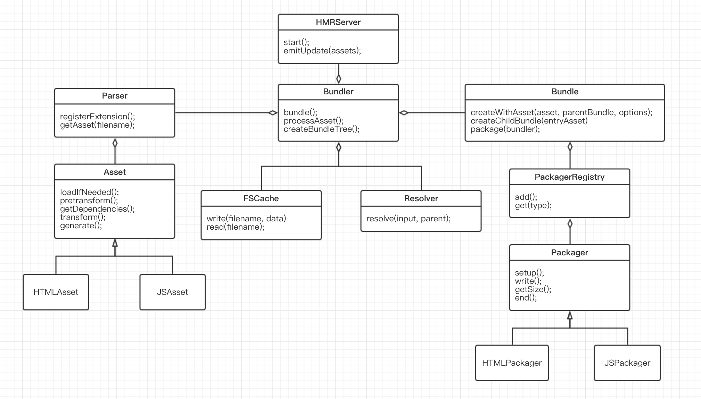

# parcel-study

demos and studies about parcel.js

## What is Parcel.js

- worker processes to enable multicore compilation
- plugin-free bundler for JS, CSS, HTML, file assets
- automatic code transformation using Babel, PostCSS, and PostHTML
- zero config code splitting
- hot module replacement

## nodejs single thread I/O

- <i>libuv</i> event-driven asynchronous I/O library

default 4 thread pools

### view threads on macOS

1. Terminal

```zsh
ps -a
ps -M -p <pid>
```

2. Activity Monitor

Initial thread 6

- UV_THREADPOOL_SIZE=X
  = OVERALL THREAD

event returned to main thread
I/O intensive rather than CPU intensive

child_process cluster to improve performance

## Parcel composition



## Parcel process

### Bundler.start()

1. plugins - localRequire, buildQueue
2. watcher(optional)
3. HMR(optional)

### Asset

- loadIfNeeded
- pretransform js: babel
- getDependencies，　 html: posthtml-parser, js: babylon.parse, collectDependencies
- transform, AST, update, delete node
- generate, [this.type]: this.contents
- generateHash

### Bundler.resolveAsset

asset.depAssets => Asset tree

### Bundle class

one bundle one file

#### properties

- assets
- childBundle

### Package

generate bundleHashes for all Assets

- start - write js, css, etc into files
- addAsset - require relationship and modules id
- end - HMR, sourceMap

### Worker

using node.js child_process to make multicore work

- WorkerFarm - manipulating child processes
- Worker - managing one process
- Child - executing task in process

## Comparison between Parcel and Webpack

| Project  | Parcel                    | Webpack |
| -------- | ------------------------- | ------- |
| prod     | 22.75s(with cache 0.975s) | 10.7s   |
| dev      | 19.42s(with cache 3.83s)  | 4.67s   |
| HMR      | 1.32s                     | 1.19s   |
| JS Size  | 1.1M                      | 837K    |
| CSS Size | 54K                       | 39K     |

### Parcel

#### Pros

- zero configuration
- html or js entry
- fast
- auto install packages
- built-in code splitting & HMR

#### Cons

- limited support configuration
- first built is slow

### Webpack

#### Pros

- flexible configuration
  — user defined project directories

#### Cons

- complicated configuration
- multicore, code-splitting, loaders need configuration
